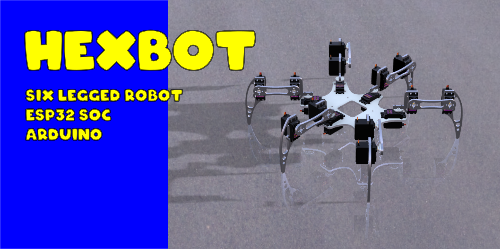

[](https://raw.githubusercontent.com/mmistakes/minimal-mistakes/master/LICENSE)

This repository contains the Arduino source code that runs on an embedded processor at the heart of the six legged robot we call HexBot. The goals of this project can be found [here](goals.md). 

# Getting Started

This project requires that you have a Hexbot robot. The Robot is made up of a custom robot chassis and PCB as well as the code in this repository. Without a version 3 or later Hexbot robot this code will not be very useful to you. 

# Documentation

Here is an index of links to helpful documents found in this repository.

## Constructing a Hexbot Robot
* List of [hardware components](/docs/hexbotHardware.md).
* Hexbot [assembly instructions](/docs/hexbotAssembly.md).
* How to [wire the motors](/docs/wireMotors.md).

## Hexbot User Guides
* Hexbot's [Web interface](/docs/hexbotWebInterface.md).
* How to [configure NVRAM remotely](/docs/hexbotWebInterface.md#config-updater-screen).
* How to [perform OTA updates](/docs/hexbotWebInterface.md#ota-updater-screen).
* Available [MQTT commands](/docs/mqttCommands.md).
* [Hexbot Operations manual](/docs/hexbotOperationManual.md).

## Hexbot Developers Guide

### Prerequisites

In order to make use of the code in this repository you will require the following items.

* A Hexbot robot made up of [this hardware](/docs/hexbotHardware.md).
* The [Hexbot custom PCB](/docs/hexbotCircuit.md).
* An [MQTT broker](/docs/MQTTbroker.md) used by the robot's [MQTT web interface](/docs/hexbotWebInterface.md).  
* A [clone](/docs/cloneRepository.md) of the Hexbot gitHub repository into your own local Git repository.

### Development Software Stack

* How to [clone](/docs/cloneRepository.md) the Hexbot gitHub repository.
* Sample [platformio.ini](AA/platformIO-MAC-example.txt) template.
* Set up [PlatformIO](https://github.com/va3wam/hexBot/blob/main/docs/cloneRepository.md#set-up-platformio).
* Recommended Visual Studio Code [plugins](https://github.com/va3wam/hexBot/blob/main/docs/cloneRepository.md#visual-studio-code-plugins).

### Code Compatability

Hexbot software runs as a monolithic firmware image. The high level logic and peripheral interactions are handled using Arduino C++. FreeRTOS is used to run a WiFi stack as well as the primitive xTaskCreatePinnedToCore() which is used to manage mutli-threaded process execution.

Hexbot's firmware is intended to run on the Espressif ESP WROOM32 "Software On a Chip" (SOC). The development board used for this SOC is the [Zerynth DOIT Esp32 DevKit v1](https://testzdoc.zerynth.com/reference/boards/doit_esp32/docs/). ```We may be switching to a different board``` Note that some standard Arduino functions such as AnalogWrite() have not been implemented on the ESP32 SOC and alternate functions such as ledcSetup(), ledcAttachPin() and ledcWrite() must be used in their place. There are some additional compatability issues of note as follows:

* The GPIO pin usage is loosey Adafruit featherboard compliant meaning it will work with some boards such as the Adafruit OLED featherboard.
* This code will NOT run on an ESP8266 unmodified because of both GPIO incompatability as well as some ESP32 specific libraries that are in use.

### Installing

A set of instructions on how to install the source code for VA3WAM projects can be found [here](https://va3wam.github.io/versionControl/).

### Testing

At this time we have no tools or standards for automated testing of Arduino code on an embedded system. 

### Deployment

Use serial over USB to load the inital code onto the embedded system. Subsequent builds can be uploaded using either serial over USB or 
a [OTA web interface](/docs/webOTA.md) hosted by the robot which allows you to do [OTA](https://en.wikipedia.org/wiki/Over-the-air_programming) updates.

### Built With

* [Visual Studio Code](https://code.visualstudio.com/) - Text editor.
* [PlatformIO](https://platformio.org/) - IDE for ESP32 based Arduino development.

If you are new to these tools then you may want to read [this](https://randomnerdtutorials.com/vs-code-platformio-ide-esp32-esp8266-arduino/).

### Contributing

Please read [CONTRIBUTING.md](contributing.md) for details on our code
of conduct, and the process for submitting pull requests to us.

### Versioning

We use [Semantic Versioning](http://semver.org/) in naming the [releases](https://github.com/va3wam/hexaBot/releases) of this code base. 

# Kinematic Model

Hexbot uses an inverse kinematic model to manipulate it's legs. To learn more about our implementation of an inverse kinematic model look <a href="/docs/kinematicModel.md">here</a>.

# Authors

* **[Old Squire](https://github.com/theagingapprentice)**
* **[Doug Elliott](https://github.com/nerdoug)**

# License

This project is licensed under the [MIT License](license.md).

# Acknowledgments

* Robot chassis design inspired by [Cameron Buss' Swampy the Hexapod](https://grabcad.com/library/swampy-the-hexapod-1).
* 3 DOF Inverse Kinematic code inspired by [Avatar
Aymen Nacer](https://github.com/AymenNacer/Forward-and-Inverse-Kinematics-for-3-DOF-Robotic-arm). 
* Tony DiCola and Adafruit Industries for their MQTT QOS1 Arduino library.
* Jeff Rowberg for the MPU6050 DMP logic. ```May not use.```
* DFRobot & John Rickman for their LiquidCrystal I2C LCD display Arduino library. ```May not use.```
* The many folks involved in porting the Arduino libraries over to the ESP32.
